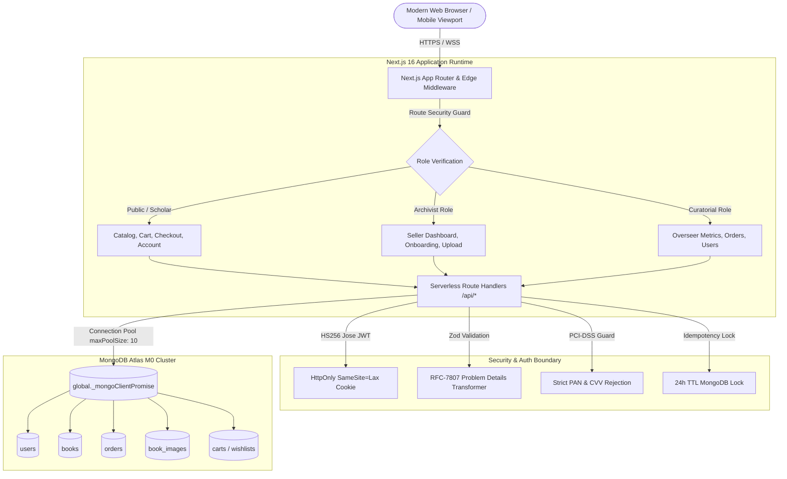

# Chronicle & Quill — Archival Historical Bookstore & Curatorial Ledger

[](https://chronicle-and-quill.vercel.app/)
[](https://github.com/Sandy-YP-Holley/chronicle-and-quill/actions/workflows/ci.yml)
[](https://nextjs.org/)
[](https://www.typescriptlang.org/)
[](https://tailwindcss.com/)
[](https://www.mongodb.com/)
[](https://playwright.dev/)
[](https://vitest.dev/)
[](https://www.w3.org/WAI/WCAG21/quickref/)

> 🏛️ **Live Production Deployment**: [https://chronicle-and-quill.vercel.app/](https://chronicle-and-quill.vercel.app/)  
> 📦 **GitHub Repository**: [https://github.com/Sandy-YP-Holley/chronicle-and-quill](https://github.com/Sandy-YP-Holley/chronicle-and-quill)  
> ⚡ **Continuous Integration (CI)**: Fully automated [GitHub Actions CI Pipeline](https://github.com/Sandy-YP-Holley/chronicle-and-quill/actions/workflows/ci.yml) running dependency audits, ESLint, strict TypeScript checking, database seeding, Vitest unit tests, full-stack API regression suites, Next.js production compilation, and Playwright cross-viewport browser/accessibility automation on every commit.

**Chronicle & Quill** is a full-stack, production-engineered antiquarian bookstore, historical archive, and scholarly press. The platform specializes in preserving and dispatching classical codices, illuminated manuscripts, renaissance treatises, and foundational historical texts across four defined epochs: **Antiquity**, **Medieval**, **Early Modern**, and the **20th Century**.

Designed to demonstrate architectural competence across both software engineering and quality assurance, Chronicle & Quill operates on a **zero-cost infrastructure model**, running entirely on serverless compute (**Vercel Free Tier**) and cloud database clusters (**MongoDB Atlas M0 Free Tier**) with zero paid third-party dependencies.

---

## 1. System Architecture & Data Flow



### Architectural Highlights
- **Serverless Connection Caching**: MongoDB Atlas connections are cached globally (`global._mongoClientPromise`) across warm lambda function invocations with `maxPoolSize: 10`, eliminating cold-start connection storms and staying safely within Atlas M0 limits.
- **Dedicated Image Document Isolation**: Uploaded manuscript covers are isolated into a specialized `book_images` collection storing raw binary buffers, serving files via streaming endpoint `/api/images/[id]` with `Cache-Control: public, max-age=31536000, immutable`. This eliminates MongoDB 16 MB document size bloating.
- **Server-Authoritative Pricing**: Zero client-supplied prices are honored; line items and totals are re-queried and computed authoritatively on the server during checkout.

---

## 2. Multi-Role RBAC Model & Core Features

Chronicle & Quill enforces a cryptographically verified, 3-tier Role-Based Access Control hierarchy:

### 1. Scholar (Buyer)
- **Catalog Stacks Exploration**: Browse 22+ preserved folios with multi-facet filters (Epoch, Format, Price boundaries, in-stock toggles) and compound full-text search with MongoDB relevance scoring.
- **Dual-State Satchel (Cart)**: Unauthenticated guests receive an ephemeral `cq_guest_id` cookie. Upon scholar login or registration, guest folios are automatically merged and deduplicated into the account's permanent cart.
- **Courier Checkout**: Simulated courier order fulfillment with live address validation and idempotency locking.
- **Personal Wishlist**: One-tap toggle to preserve volumes in personal study archives.
- **Lifecycle Tracking**: Visual timeline tracking orders through `Pending` -> `Confirmed` -> `Shipped` -> `Delivered`, with customer cancellation capabilities on pending dispatches.

### 2. Archivist (Seller)
- **Dealership Onboarding**: Unlocked through `/seller/onboard`. Elevates verified scholars to archivist status.
- **Inventory Management**: Real-time sales statistics, stock counts, and price editing.
- **Dual-Source Cover Selector**: Catalog new folios using either remote HTTPS URLs (with domain whitelisting) or direct drag-and-drop local file uploads (up to 10 MB) stored in MongoDB Atlas.
- **Anti-BOLA Protection**: Broken Object Level Authorization guards ensure archivists can only modify or delete manuscripts they personally catalogued.

### 3. Curatorial Overseer (Admin)
- **Hardcoded Security Provisioning**: Pre-configured admin account (`admin@chronicleandquill.com`) seeded into MongoDB with zero public self-elevation vectors.
- **Curatorial Metrics Dashboard**: Real-time business intelligence: Gross historical revenue, total volume count, registered scholars, and active archivists.
- **Irreversible State Machine**: Order status management with terminal state locks (`Delivered` and `Cancelled` orders cannot be reverted).
- **Referential Integrity Soft-Delisting**: Deleting a book with active historical orders soft-delists it (`isDelisted: true`, `stock: 0`) rather than purging the document, preserving line-item history.
- **Safe User Directory**: User administrative directory explicitly excludes `passwordHash` via MongoDB projections.

---

## 3. Security, Authorization & Concurrency Baseline

| Security Layer | Implementation Mechanism | Threat Mitigated |
| :--- | :--- | :--- |
| **Anti-IDOR / BOLA** | Claims extracted strictly from signed JWT (`token.sub`); route parameters checked against identity | Object-level forgery, cross-tenant data leaks |
| **Atomic Inventory Locks** | Conditional queries (`{ stock: { $gte: quantity } }`, `$inc: { stock: -quantity }`) | Overselling, checkout concurrency races |
| **Idempotency Locks** | Cryptographic hash header `Idempotency-Key` stored in MongoDB with 24-hour TTL index | Duplicate charges, double-dispatch on rapid clicks |
| **PCI-DSS Simulated Guard** | Server immediately rejects requests containing credit card PANs or CVVs with HTTP 400 | Accidental transmission of actual cardholder data |
| **RFC-7807 Error Standards** | Custom Zod error transformer returning structured `errors: Record<string, string>` | Vague errors, obscured input failures |
| **HTTP Security Headers** | CSP, HSTS, X-Content-Type-Options: nosniff, X-Frame-Options: DENY, Referrer-Policy | XSS, clickjacking, MIME sniffing, downgrade attacks |
| **Input Sanitization** | `escapeRegex()` utility neutralizing regex metacharacters (`.*+?^${}()\|[]\\`) | ReDoS attacks, NoSQL regex query injection |

---

## 4. QA Strategy, Test Matrix & Coverage

```
================================================================================
                    CHRONICLE & QUILL — QUALITY METRICS
================================================================================
  Automated Business Rule & Unit Tests (Vitest):        30 / 30 Passed (100%)
  Full-Stack Regression & API Tests (TSX):             116 / 116 Passed (100%)
  End-to-End Browser Automation Tests (Playwright):     26 / 26 Passed (100%)
  ----------------------------------------------------------------------------
  Total Automated Test Verification Suite:             172 / 172 Passed (100%)
  Manual Test Cases Documented & Verified:              90 / 90 Passed (100%)
  Automated Accessibility Violations (WCAG 2.1 AA):      0 Violations (Clean)
  Strict TypeScript Compilation:                         0 Errors (tsc --noEmit)
  ESLint Code Quality:                                   0 Warnings, 0 Errors
  Next.js Production Bundle Build:                       48 Routes Compiled (1037ms)
  GitHub Actions Automated CI Pipeline:                  All Workflows Green (100% Passing)
================================================================================
```

### Comprehensive QA Documentation Portfolio (`QA/`)

Detailed testing artifacts are located in the [QA/](QA) directory:

- [QA/TEST-PLAN.md](QA/TEST-PLAN.md): Strategic master test plan outlining system architecture, test levels, exit criteria, and device matrix.
- [QA/MANUAL-TESTS.md](QA/MANUAL-TESTS.md): Comprehensive repository of **90 detailed manual test cases** covering Discovery, Cart, Checkout, Auth, RBAC, Inventory, Local Image Upload, Admin Suite, Accessibility, and Performance.
- [QA/CURL-TESTS.md](QA/CURL-TESTS.md): Reproducible cURL command suite testing every public, scholar, seller, and admin API endpoint with expected response structures and RFC-7807 problem details.
- [QA/EXPLORATORY.md](QA/EXPLORATORY.md): 5 time-boxed exploratory testing charters covering Cart Concurrency, Session Hijacking/IDOR, Local Image Boundary Attacks, Multi-Role RBAC Privilege Escalation, and Screen Reader Navigation.
- [QA/TRACEABILITY.md](QA/TRACEABILITY.md): Requirements Traceability Matrix (RTM) mapping requirements `REQ-01` through `REQ-30` across all test levels.
- [QA/BUG-REPORTS.md](QA/BUG-REPORTS.md): Standardized defect classification matrix (Severity and Priority scales) and resolution reports for all 8 defects resolved across development iterations.
- [QA/REGRESSION.md](QA/REGRESSION.md): Multi-tiered regression testing strategy, smoke test verification checklist, and CI/CD pipeline automation triggers.
- [QA/TEST-EXECUTION.md](QA/TEST-EXECUTION.md): Granular execution metrics breakdown for Vitest, TSX API, and Playwright browser runs.
- [QA/FINAL-REPORT.md](QA/FINAL-REPORT.md): Portfolio-ready executive summary, production-readiness verification, and curatorial QA sign-off.

---

## 5. Local Setup, Environment Variables & Seed Guide

### Prerequisites
- Node.js 20.x or higher
- npm 10.x or higher
- MongoDB Atlas connection string (or local MongoDB 7.0 instance)

### Quickstart Installation

1. **Clone the Repository**:
   ```bash
   git clone https://github.com/Sandy-YP-Holley/chronicle-and-quill.git
   cd chronicle-and-quill
   ```

2. **Install Dependencies**:
   ```bash
   npm install
   ```

3. **Configure Environment Variables**:
   Copy the example environment file and configure your MongoDB connection:
   ```bash
   cp .env.example .env.local
   ```
   Edit `.env.local`:
   ```env
   MONGODB_URI=mongodb+srv://<username>:<password>@cluster.mongodb.net/?retryWrites=true&w=majority
   MONGODB_DB=chronicle_quill
   SESSION_SECRET=chronicle_and_quill_super_secure_secret_key_32chars_minimum!
   NEXT_PUBLIC_APP_URL=http://localhost:3000
   NODE_ENV=development
   ```

4. **Seed Database**:
   Populates 22 historical manuscripts, search indexes, and demo accounts:
   ```bash
   npm run seed
   ```

5. **Start Development Server**:
   ```bash
   npm run dev
   ```
   Open [http://localhost:3000](http://localhost:3000) in your browser.

---

## 6. Pre-Configured Demo Credentials

| Role | Email | Password | Unlocked Capabilities |
| :--- | :--- | :--- | :--- |
| **Curatorial Admin** | `admin@chronicleandquill.com` | `HistoricalReader2026!` | Full Admin Overseer portal, KPI metrics, order status locks, user directory |
| **Archivist Seller** | `seller@chronicleandquill.com` | `HistoricalReader2026!` | Seller dashboard, inventory management, 10 MB local image uploads, folio creation |
| **Scholar Buyer** | `scholar@chronicleandquill.com` | `HistoricalReader2026!` | Catalog discovery, cart staging, simulated checkout, order history, wishlist |

---

## 7. Test & Verification Execution Commands

Execute the verified automated testing suites:

```bash
# Static analysis & type safety
npm run typecheck    # Strict TypeScript verification (0 errors)
npm run lint         # ESLint analysis (0 warnings, 0 errors)

# Automated unit testing
npm run test:unit    # Vitest business rule tests (30/30 passed)

# Full-stack API & security integration
npm run test:qa      # 116-test API, RBAC, and error validation suite (116/116 passed)

# Browser automation & accessibility
npm run test:e2e     # Playwright multi-viewport & axe audits (26/26 passed)

# Complete end-to-end verification
npm run test:all     # Runs Unit, QA, and Playwright suites sequentially (172/172 passed)

# Production compilation
npm run build        # Compiles all 48 routes with Turbopack
```

---

## 8. Repository File Map

```
chronicle-and-quill/
├── .github/
│   ├── dependabot.yml                  # Automated weekly npm & actions scanning
│   └── workflows/
│       ├── ci.yml                      # Main CI pipeline (Audit -> Lint -> Typecheck -> Unit -> QA -> Build -> E2E)
│       └── security-scan.yml           # Gitleaks automated secret scanner
├── QA/                                 # Complete QA Portfolio & Artifacts
│   ├── BUG-REPORTS.md                  # Defect severity/priority scales & resolution logs
│   ├── CURL-TESTS.md                   # Reproducible cURL API command matrix
│   ├── EXPLORATORY.md                  # 5 time-boxed exploratory testing charters
│   ├── FINAL-REPORT.md                 # Executive summary & production sign-off
│   ├── MANUAL-TESTS.md                 # 90 detailed manual test cases
│   ├── REGRESSION.md                   # Multi-tier regression strategy & smoke checklist
│   ├── TEST-EXECUTION.md               # Granular execution metrics breakdown
│   ├── TEST-PLAN.md                    # Strategic master test plan
│   ├── TRACEABILITY.md                 # Requirements Traceability Matrix (REQ-01 to REQ-30)
│   ├── run-all-tests.ts                # Master runner for 116 full-stack tests
│   ├── test-frontend.ts                # Route accessibility, headers, and TTFB tests
│   ├── test-phase1-foundation.ts       # Database indexing and catalog search tests
│   ├── test-phase2-api.ts              # Cart, checkout, IDOR, and order lifecycle tests
│   ├── test-rbac.ts                    # Multi-role RBAC, onboarding, and BOLA tests
│   └── test-validation.ts              # RFC-7807 problem details & image upload tests
├── public/                             # Static assets, icons, and favicon
├── scripts/
│   ├── seed.ts                         # Automated MongoDB index creation & data seeder
│   └── test-api.ts                     # Rapid smoke test script
├── src/
│   ├── app/                            # Next.js 16 App Router
│   │   ├── account/                    # Scholar profile & order history
│   │   ├── admin/                      # Curatorial Overseer management suite
│   │   ├── api/                        # Serverless Route Handlers
│   │   │   ├── admin/                  # Overseer metrics, orders, users endpoints
│   │   │   ├── auth/                   # Register, login, logout, me endpoints
│   │   │   ├── books/                  # Public catalog and single folio endpoints
│   │   │   ├── cart/                   # Cart additions, updates, removals
│   │   │   ├── checkout/               # Atomic checkout with idempotency locks
│   │   │   ├── images/                 # Binary streaming cover image endpoint
│   │   │   ├── orders/                 # Customer order inspection & cancellation
│   │   │   ├── seller/                 # Dealership onboarding, inventory, uploads
│   │   │   └── wishlist/               # Personal scholar collection endpoints
│   │   ├── books/                      # Manuscript catalog stacks & folio detail view
│   │   ├── cart/                       # Satchel (cart) management view
│   │   ├── checkout/                   # Courier checkout & order placement
│   │   ├── login/                      # Scholar & staff authentication portal
│   │   ├── order/                      # Order confirmation & dispatch status tracking
│   │   ├── register/                   # Scholar guild account registration
│   │   ├── search/                     # Full-text archival search interface
│   │   ├── seller/                     # Archivist dashboard, book editor, onboarding
│   │   ├── wishlist/                   # Personal scholar saved folios gallery
│   │   ├── error.tsx                   # Global error boundary
│   │   ├── globals.css                 # Classical styling & design tokens
│   │   ├── layout.tsx                  # Root layout with fonts, providers, and viewport
│   │   └── not-found.tsx               # Curatorial 404 folio missing view
│   ├── components/                     # Reusable UI component modules
│   │   ├── books/                      # BookCard, CoverSelector, Skeletons
│   │   ├── cart/                       # CartDrawer, CartLineItem
│   │   ├── layout/                     # Navbar, MobileNav, Footer
│   │   └── ui/                         # Toast notification and modal primitives
│   ├── context/                        # React Context store provider (cart, user, wishlist)
│   ├── lib/                            # Core utilities (mongodb, auth, api-response, validators)
│   ├── middleware.ts                   # Edge route protection & RBAC guard
│   └── models/                         # Domain schemas (book, user, order, cart, image)
├── tests/
│   ├── e2e/                            # Playwright browser test specifications
│   │   ├── accessibility.spec.ts       # Automated axe-core WCAG 2.1 AA audits
│   │   ├── auth-rbac-lifecycle.spec.ts # Multi-role login, portal access, and logout
│   │   ├── responsive-matrix.spec.ts   # Desktop (1440px) vs Mobile (390px) layouts
│   │   ├── smoke-flow.spec.ts          # Discovery to order fulfillment journey
│   │   └── stock-idempotency.spec.ts   # Double-click prevention & inventory depletion
│   └── unit/                           # Vitest business rule tests
│       ├── cart-boundary.test.ts       # Cart boundary limits and integer checking
│       ├── order-state-machine.test.ts # Order transition rules & terminal locks
│       ├── pricing-shipping.test.ts    # Subtotal and $100 free shipping calculations
│       └── schema-validation.test.ts   # Zod boundary and regex injection tests
├── next.config.ts                      # Security headers, remote patterns, dev indicators
├── playwright.config.ts                # Multi-viewport Playwright runner configuration
├── vercel.json                         # Vercel serverless region optimization (iad1)
├── vitest.config.ts                    # Vitest runner configuration with path aliasing
└── package.json                        # Project dependencies and test automation scripts
```

